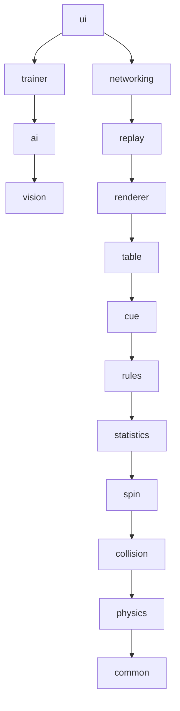

# Architecture Overview

## Purpose

This document is the single entry point for understanding how CueForge is
put together. Every other file under `docs/architecture/` goes deeper on
one part of what's summarized here.

## Layered design

(Arrows above show conceptual layering, not literal Cargo dependencies —
see `docs/architecture/DataFlow.md` for the exact dependency direction,
which is strictly one-way from top to bottom.)

## The simulation core

At the center of CueForge is a deterministic simulation core
(`crates/physics`, `crates/collision`, `crates/spin`, `crates/common`)
that knows nothing about rendering, networking, or AI. It exposes:

- A `World` of balls, table geometry, and cue input
- A `step(world, dt) -> Vec<Event>` function that advances the simulation
  deterministically
- A set of `Event`s (collision, pocket, rail contact, spin change) that
  everything above the core reacts to

## Everything else is a consumer of events

The game layer (`rules`, `statistics`), presentation layer (`renderer`,
`replay`), and application layer (`ui`, `trainer`, `ai`, `vision`,
`networking`) all subscribe to the event stream produced by the
simulation core rather than mutating simulation state directly. This is
what keeps the core testable and deterministic in isolation.

## Why ECS

CueForge uses an Entity-Component-System model (see `ECS.md`) so that the
same `World` representation can be:

- stepped forward by the physics core,
- replayed from a recorded event log (`crates/replay`),
- synchronized across a network (`crates/networking`),
- or driven by an AI opponent (`crates/ai`),

without those consumers needing different data models.

## Extending CueForge

Third-party extensions (a new trainer UI, a new AI model, a new renderer)
should integrate through the plugin interface described in
`PluginSystem.md`, not by depending on internal crate details. This is
what lets CueForge Studio, CueForge Vision, and CueForge AR live in
separate repositories and still build on a stable core.

## Related documents

- `ECS.md` — entity/component/system model in detail
- `DataFlow.md` — exact data flow and the one-way crate dependency graph
- `Systems.md` — the systems that run each simulation step
- `Events.md` — the event model consumers subscribe to
- `Components.md` / `Resources.md` — data model reference
- `PluginSystem.md` — extension points
- `Networking.md` — how determinism enables network sync
- `Replay.md` — how determinism enables replay
- `Serialization.md` — on-disk and on-wire formats
