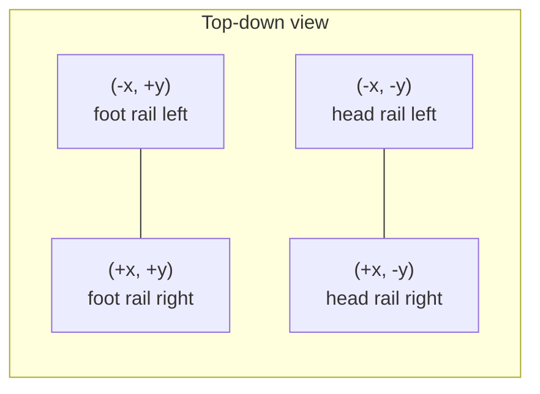

# Coordinate System & Units

## Units

CueForge uses SI units internally, wrapped in newtype units to prevent
mixing (see `STYLEGUIDE.md`):

| Quantity | Type | Unit |
|---|---|---|
| Length | `Meters` | m |
| Time | `Seconds` | s |
| Mass | `Kilograms` | kg |
| Velocity | `MetersPerSecond` | m/s |
| Angular velocity | `RadiansPerSecond` | rad/s |
| Force | `Newtons` | N |
| Angle | `Radians` | rad |

Display/UI layers may convert to feet/inches or other units for regional
presentation, but the simulation core never operates on non-SI values.

## World frame

- Origin: center of the table bed, at cloth height (z = 0).
- **X axis**: along the table's short axis (width).
- **Y axis**: along the table's long axis (length), positive toward the
  "foot" of the table (where the rack is set).
- **Z axis**: vertical, positive up.

## Ball frame

Each ball has its own body-frame angular velocity vector, whose
projection onto the world frame determines top/bottom spin (Y-axis
component), side spin / English (Z-axis component), and swerve-inducing
components (X-axis component) — see `Spin.md` and `English.md`.

## Standard reference values

| Constant | Value | Source |
|---|---|---|
| Ball radius (pool, regulation) | 0.028575 m (2.25 in diameter) | WPA equipment spec |
| Ball mass (pool, regulation) | 0.170–0.171 kg | WPA equipment spec |
| Snooker ball radius | 0.02625 m (52.5mm diameter) | WPBSA spec |

`TODO: verify` — full citation list to be added to `Calibration.md` once
sourced from primary equipment specifications rather than secondary
summaries.
